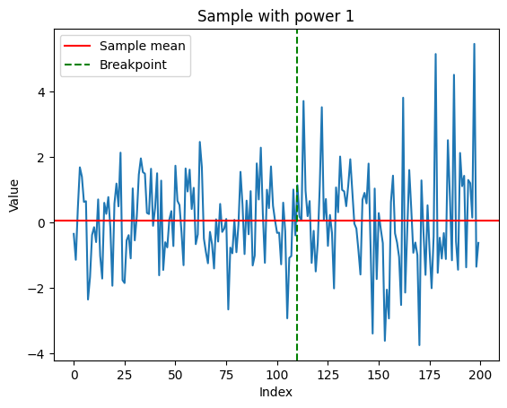
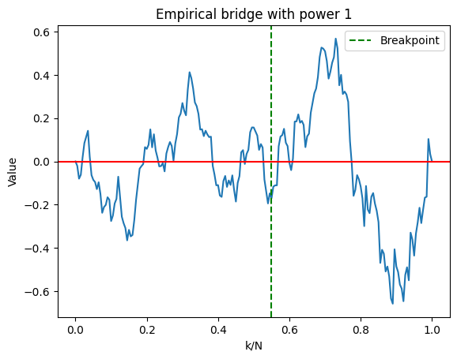
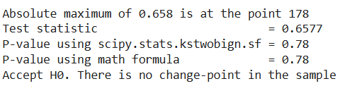
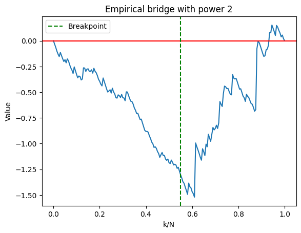
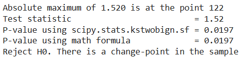
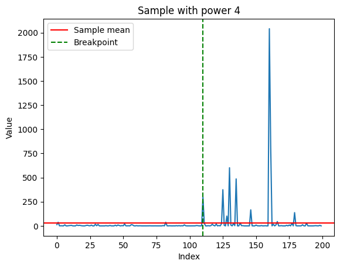
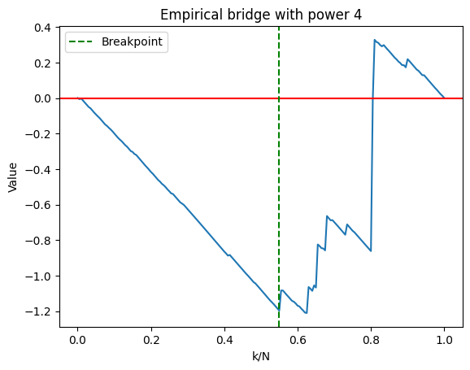
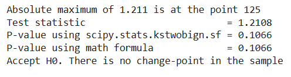

# Testing if the sample has a breakpoint using empirical bridges

This task is to test the homogeneity of samples generated from two different distributions. 

## Purpose
This project implements and evaluates a statistical test for detecting structural breaks in time series data. The test is based on the **Empirical Bridge Process** — the normalized cumulative sum of residuals — whose asymptotic behavior under the null hypothesis follows a Brownian bridge.

## Problem Statement
Given a sample with a potential change-point at position 110 (110 observations from cosine distribution, 90 from hypsecant distribution), we:
1. Implement the empirical bridge test statistic
2. Calculate its asymptotic p-value
3. Estimate empirical power through Monte Carlo simulation
4. Analyze the effect of data transformations (x², x⁴) on test performance

## Results
### Original sample

### Sqaured sample

### Sample to the 4-th power

### Power, mean difference and variance difference
| Transformation	| Power |	Mean Difference |	Variance Difference |
| --- | --- | --- | --- |
| x¹ (original) |	0.043	| -0.0015 |	-1.1808 |
|x² (squared) |	0.545	| -1.1913 |	-21.7468 |
|x⁴ (4th power)	| 0.346 |	-27.5467 |	-50400.93 |

#### 1. Original data ($x$)

*   Power ≈ 0.043. Very low probability of rejecting $H_{0}$, when $H_{1}$ is true
*   Mean difference ≈ 0 — Cosine and hypsecant distributions have essentially identical means. That is probably why, $H_{0}$ would be accepted
*   Moderate variance difference (-1.1808) — but the test is insensitive to variance changes in raw data

The test falsely accepted $H_{0}$

#### 2. Squared data ($x^2$)
* Power ≈ 0.545. More than 50% of correctly rejecting $H_{0}$!!!
* Mean difference = -1.191 — Mean shift is detectible
* Large variance difference (-21.74) amplifies the effect after transformation

The test correctly rejected $H_{0}$

#### 3. Data powered to the 4-th power ($x^4$)
* Power ≈ 0.346. Less than 35% of correctly rejecting $H_{0}$
* Mean difference = -27.54 — Massive theoretical difference
* Extreme variance difference (-50400) — indicates heavy-tailed, unstable data
* Strange: despite larger mean difference than x², power is lower

The test falsely accepted $H_{0}$

### Conclusion
The squared transformation achieves the optimal balance for this test

## Some theory
### Building empirical bridge
Empirical bridge process it a stohastic process

Given the sample $X_0, X_1, \dots, X_n$ we define its residuals as:
$$ e_i = X_i - \bar{X} $$
, where $\bar{X}$ is the mean of the sample \
The cumulative sum of residuals is:
$$ S_k = \sum_{i=0}^k e_i$$
The Empirical Bridge Process $B_n(t)$ is a continuous-time process defined for $t \in [0, 1]$:
$$ B_n(t) = \frac{S_{\lfloor t\cdot n \rfloor}}{\sqrt{n}\cdot\hat{\sigma}}$$
, where $\hat{\sigma}^2$ is the sample variance
\
\
Key property is that $S_0 = 0$ and $S_n = \sum\limits_{i=0}^n e_i = \sum\limits_{i=0}^{n}X_i - n \cdot \frac{\sum\limits_{i=0}^{n}X_i}{n} = 0$\
So $B_n(0) = B_n(1) = 0$

### Statistical test to identify the existence of a breakpoint
Building a statistical test to identify the breakpoint\
**H0:** Whole sample is homogeneous (no change)\
**H1:** There is a change-point in the sample\
Change-point statistic is 
$$ T_n = \max_{1 \leq k \leq n} \frac{|S_k|}{\sqrt{n}\cdot \hat{\sigma}} $$
Under H0 hypothesis:
$$ T_n  \xrightarrow{d} \sup_{0\leq t \leq 1}{|B(t)|}$$
This equation means, that as $n \to \infty$, then the statistic $T_n$ starts behaving more like the supremum of Brownian bridge process\
The distribution of the supremum of Brownian bridge process is the Kolmogorov-Smirnov distribution

---

p-value is the probability of observing test statistic as extreme as the given (or even more extreme) under the assumption on H0 (sample ifs homogeneous)\
So is p-value is big, than we accept H0. Otherwise reject it, because this test statistic seems very unlikely.

So:
$$ \text{p-value} = P(x > T_n | H_0\text{ is true})$$

If $T_n$ is bigger than critical value, then p-value is less, than significance level and we reject H0

For a Kolmogorov-Smirnov distirbution the survival function is:
$$ P(\sup{|B(t)|} > T_n | H_0\text{ is true}) = 2\cdot\sum\limits_{m=1}^{\infty}(-1)^{m - 1}e^{-2m^2x^2}$$

### Power of the test (using Mote-Carlo simulation)
Power of the test = Probability of correctly rejecting $H_{0}$ when $H_{1}$ is true
So we just generate the sample, containing a breakpoint, 1000 times and calculate the number of samples, which have p-value < 0.05 (correctly rejecting $H_{0}$)