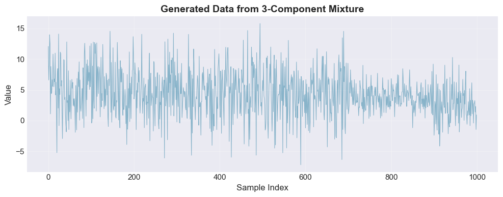
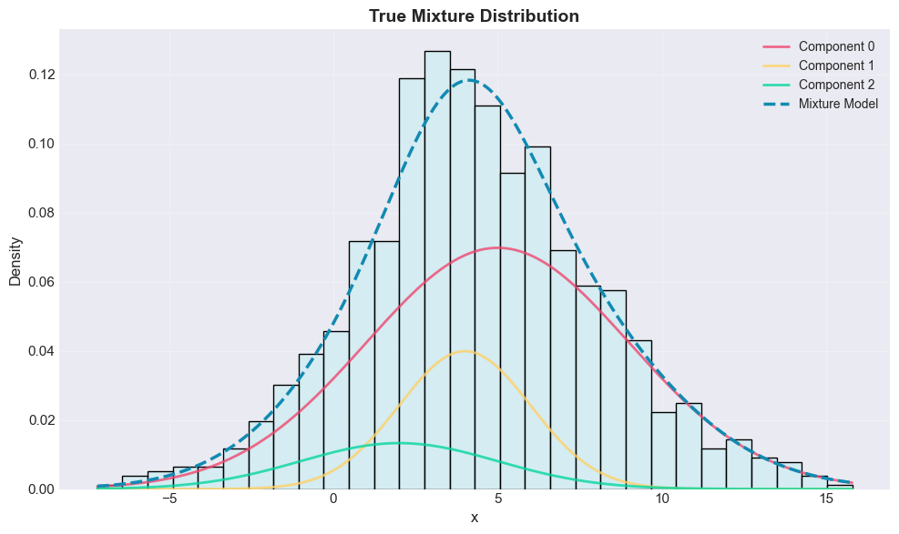
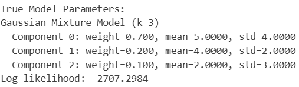
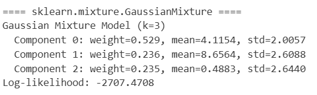

# Gaussian Mixture Model with EM Algorithm

This project implements EM-algorithm for estimating gaussian mixture parameters to fit the given data.

## Overview

Gaussian mixture model (GMM) is a probabilistic model, that reperesents an unknow distribution as a weighted sum of Gaussian distributions.
So the pdf(x) of such a distribution is:

$$ p(\mathbf{x}) = \sum_{i=1}^{k} w_i \cdot \mathcal{N}(\mathbf{x} \mid \mu_i, \sigma_i) $$

To estimate a given sample from unknown distribution with a gaussian mixture, I use EM algorithm

## Features

- **EM Algorithm**
- **Multiple Initialization Strategies**:
  - Random initialization
  - K-means based initialization
  - Percentile-based initialization
- **Automatic Model Selection**: BIC criterion for determining optimal number of components
- **Validation**: Comparison with scikit-learn's GaussianMixture
- **Experiments using synthetic data and real-world data**

## Technical Implementation

### Mathematical Background

**EM Algorithm for GMM:**
EM algotithm is an iterative algorithm, which sequentially executes E and M steps. E step is used to calculate responsibilities using the parameters estimated at the previous step (or their initial estimates). M step is used to update parameter estimates using calculated responsibilites

- **E-step**: Calculate responsibilities

$$
\gamma_{i,j}^{(t)} = \frac{w_j^{(t)} \cdot \mathcal{N}(\mathbf{x}_i \mid \mu_j^{(t)}, \sigma_j^{(t)})}{\sum\limits_{p=1}^{k} w_p^{(t)} \cdot \mathcal{N}(\mathbf{x}_i \mid \mu_p^{(t)}, \sigma_p^{(t)})}
$$


- **M-step**: Update parameters
Update weights:

$$ w_k^{(t+1)} = \frac{\sum_{i=1}^N \gamma_{i, k}^{(t)}}{N}$$

Update means:

$$ \mu_k^{(t+1)} = \frac{\sum_{i=1}^N \gamma_{i, k}^{(t)}\cdot x_{i}}{\sum_{i=1}^N \gamma_{i, k}^{(t)}} $$

Update standard deviations:

$$\sigma_k^{(t+1)} = \frac{\sum_{i=1}^N \gamma_{i, k}^{(t)}\cdot (x_{i} - \mu_k^{(t+1)})^2}{\sum_{i=1}^N \gamma_{i, k}^{(t)}} $$

- **Stopping criteria**
    - This project iterates EM-steps for a given **N** number of steps
    - Usually log-likelihood convergence is used

$$ |\ell(\boldsymbol{\theta}^{(t+1)}) - \ell(\boldsymbol{\theta}^{(t)})| < \epsilon $$


**Log-likelihood of the model**
The quality of the estimated mixture is evaluated using log-likelihood of the observed sample under the model:

$$ \ell(\boldsymbol{\theta}) = \sum_{i=1}^N \log \left( \sum_{j=1}^k w_j \cdot \mathcal{N}(\mathbf{x}_i \mid \mu_j, \sigma_j) \right) $$

, where $\boldsymbol{\theta}$ are the estimated parameters' vector

The log-likelihood is a scalar value that measures how well the model
explains the observed data: higher values indicate a better fit.

**NB!** In the EM algorithm, the log-likelihood is guaranteed to be
non-decreasing at each iteration, and its convergence is used as
a stopping criterion


**Model Selection via BIC:**
The Bayesian Information Criterion (BIC) is used to select the number of
components in the Gaussian Mixture Model.

For each candidate number of components k, the EM algorithm is run until
convergence and the BIC value is computed as

$$ BIC = −2\log L + p\log N $$

,where $\log L$ is the final log-likelihood, $p$ is the number of free model
parameters, and $N$ is the number of data points.

In our case $p=3*k-1$, because we need to estimate $k$ means, $k$ standard deviations and $k$ weights. But we know, that $\sum w_{j} = 1$. Thus, it is enough to estimate only $k-1$ weights, that's why $p=k+k+(k-1) = 3k-1$

The model with the lowest BIC value is preferred. Although models with
more components generally achieve higher log-likelihood, BIC penalizes
model complexity and prevents overfitting when additional components do
not provide sufficient improvement in data likelihood

## Results

### Validation on Synthetic Data
In this test `GaussianMixtureAnalyzer` class generates sample of size 1000 from the distribution, which is a gaussian mixture of 3 components:
- Component 1: μ₁ = 5, σ₁ = 4, w₁ = 0.7
- Component 2: μ₂ = 4, σ₂ = 2, w₂ = 0.2  
- Component 3: μ₃ = 2, σ₃ = 3, w₃ = 0.1

And then it ran `GaussianMixture_self.fit` with 3 different initialisation strategies. The results are:





")

")

")


Here are the parameter values for different models:



")

")

")



#### Conclusion
* EM Algorithm with K-means initialization has the biggest log-likelihood value (-2705.1). It is even bigger, that the log-likelihood value calculated using real parameters 🙃
* EM Algorithm with percentile-base initialization has the closest weights and means to the real ones
* EM Algorithm with K-means initialization and sklearn.GaussianMixture have very close mean and standrard deviation parameters. But those are different to the real ones 

### Experiment using real-world data

**Data Source**: Historical forex data from [Dukascopy](https://www.dukascopy.com/swiss/english/marketwatch/historical/)

**Datasets**:
* **SGD/JPY** (Singapore Dollar/Japanese Yen) - Log-transformed tick volumes, 1-minute interval, December 16, 2024, BID prices
* **USD/CZK** (US Dollar/Czech Koruna) - Log-transformed tick volumes, 1-minute interval, December 16, 2024, BID prices

**What is "Tick Volume"?**  
Tick volume counts the number of price updates (ticks) per time interval. Since forex is decentralized, real trade volumes aren't publicly available. However, tick volume serves as a good proxy for market activity: high tick volume indicates active trading and price movement, while low tick volume suggests quiet market conditions.

**Why Log-Transform?**  
Raw tick volumes vary drastically (from 1-2 ticks to thousands), creating a highly skewed distribution. Taking the logarithm compresses this scale, making the data more symmetric and suitable for Gaussian mixture modeling

The Gaussian Mixture Model was applied to the distribution of log-transformed trading volumes for these currency pairs to identify underlying patterns and cluster structures in market activity. As we do not know the component number, BIC analyzis was used

")
")

")
")

#### Conclusion
* Real-world data can sometimes be estimated with just single Gaussian distribution (as we can see for SGD/JPY)
* 

## Skills Demonstrated

- Statistical machine learning algorithm implementation
- Object-oriented design and software architecture  
- Mathematical optimization (EM algorithm)
- Data analysis and visualization
- Model validation and comparison

## Conclusion
Initialisation matters. Random intialisation gives the worst value of log-likelihood. K-means gives the best log-likelihood value (it is even better, than the sklearn -- in this test)

Estimated parameters using EM-algorithm are very close to the original ones and to the sklearn estimated parameters.
## Usage Examples

### Example 1: Basic GMM Fitting with Known Number of Components

```python
import numpy as np
from gaussian_mixture import GaussianMixture_self, GaussianMixtureAnalyzer

# Load or generate your data
data = np.random.randn(1000)  # Example data

# Create analyzer
analyzer = GaussianMixtureAnalyzer(data)

# Fit with 3 components, testing all initialization methods
result = analyzer.analyze_with_given_k(k=3, verbose=True)

# Access the best model
best_model = result["gaussian_mixture"]
print(f"Log-likelihood: {result['log-likelihood']:.2f}")
print(f"BIC: {result['bic']:.2f}")
```

### Example 2: Automatic Model Selection with BIC

```python
# When you don't know the optimal number of components
analyzer = GaussianMixtureAnalyzer(data)

# BIC will test k from 1 to 7 and select the best
analyzer.BIC_analyse(min_k=1, max_k=8, verbose=True)

# Access results
print(f"Optimal k: {analyzer.best_k}")
print(f"Best BIC: {min(analyzer.bics):.2f}")

# Plot BIC curve and best model
analyzer.plot_bic_results()
```

### Example 3: Generate Synthetic Data from Known Mixture

```python
# Define true mixture parameters
true_mixture = GaussianMixture_self(
    k=3,
    initial_means=[0, 5, 10],
    initial_std_devs=[1, 2, 1.5],
    initial_weights=[0.3, 0.5, 0.2]
)

# Generate synthetic data
analyzer = GaussianMixtureAnalyzer()
analyzer.generate_data_from_gaussian_mixture(true_mixture, N=1000)

# Fit and recover parameters
result = analyzer.analyze_with_given_k(k=3, verbose=True)
```

### Example 4: Using Specific Initialization Methods

```python
# Create a GMM instance
gmm = GaussianMixture_self(k=3)

# Try different initialization methods
# Method 1: K-means based 
gmm.fit(data, init_func="k_means", N=30, verbose=True) # gmm will store estimated parameters: self.weights, self.distributions -- array of Gaussians

# Method 2: Percentile-based
gmm.fit(data, init_func="percentile", N=30, verbose=False)

# Method 3: Random
gmm.fit(data, init_func="rand", N=30, verbose=False)

# Visualize the result
gmm.plot("Fitted GMM with K-means Initialization")
```

### Example 6: Validate Against scikit-learn

```python
# Compare with sklearn implementation
analyzer = GaussianMixtureAnalyzer(data)

# Your implementation
result = analyzer.analyze_with_given_k(k=3, verbose=True)

# scikit-learn implementation
analyzer.analyze_sklearn(k=3, verbose=True)
```

### Example 8: Accessing Model Parameters

```python
# After fitting
gmm = GaussianMixture_self(k=3)
gmm.fit(data, init_func="k_means", N=30)

# Access individual components
for i in range(gmm.k):
    mean = gmm.distributions[i].mu
    std = gmm.distributions[i].sigma
    weight = gmm.weights[i]
    print(f"Component {i}: μ={mean:.3f}, σ={std:.3f}, w={weight:.3f}")

# Evaluate PDF at specific points
x_test = np.array([0, 1, 2, 3])
for x in x_test:
    pdf_value = gmm.pdf(x)
    print(f"PDF at x={x}: {pdf_value:.6f}")

# Get log-likelihood
print(f"Model log-likelihood: {gmm.log_likelihood:.2f}")
```
